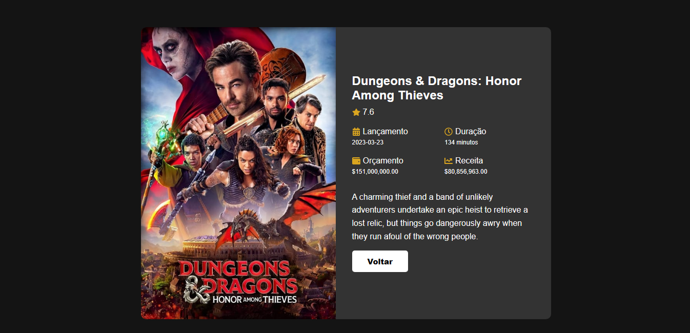

##  <h1 align="center"> 🎬Listagem dos filmes🍿</h1>

## 📝 Descrição
O projeto final de frontend, consiste que o usuário tenha acesso a uma listagem de filmes mais populares do dia e consiga encontrar novos filmes ao clicar em um item na listagem.
O acesso da listagem do filme só foi realizada através do uso da API [themoviedb](https://developers.themoviedb.org/3/getting-started/introduction). 

[Clique aqui](https://movie-fl25cjg1a-vieirameloroberta.vercel.app) para acessar o deploy do projeto

## 🚀 Tecnologias utilizadas
- React js
- styled-components
- axios





## <h2>🔄 Rodando o projeto localmente</h2>  
  
Clone o projeto via HTTPS

```bash
  git clone https://github.com/Promobit/front-end-challenge.git
```

Entre no diretório do projeto

```bash
  cd movie
```

```bash
  npm start
```

